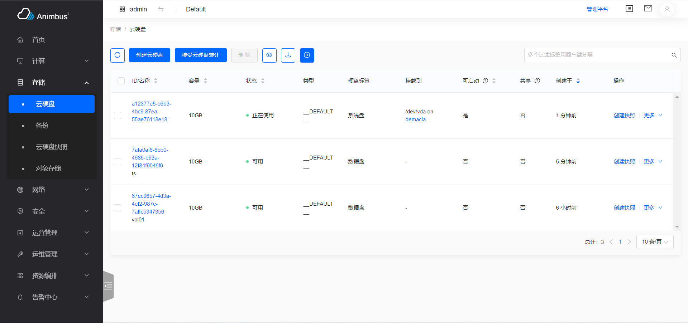
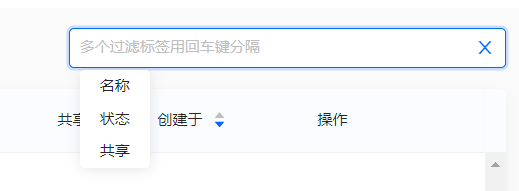
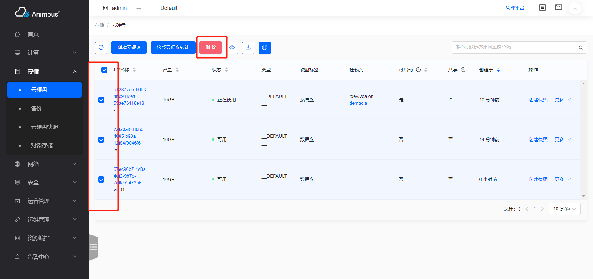
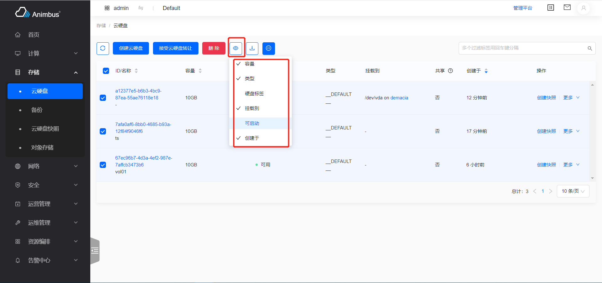
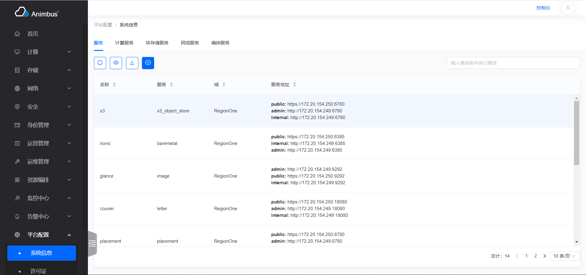

简体中文 | [English](../../en/develop/3-1-BaseList-introduction.md)

# 用途

- 各资源列表页的基类

  

- 支持数据分页

  

- 支持搜索

  

- 支持手动刷新数据

  

- 支持数据下载

  

- 支持批量操作

  

- 具有自动刷新数据的功能(每隔 60 秒自动刷新列表数据，用户无操作的情况下，30 分钟后不再自动刷新，可暂停自动刷新功能)

  

- 可配置列表表头

  

- 各资源列表页通过复写函数即可完成

# BaseList 代码文件

- `src/containers/List/index.jsx`

# BaseList 属性与函数定义介绍

- 资源列表继承于 BaseList 组件
- 只需要复写部分函数即可完成页面的开发
- 属性与函数分为以下四种，
  - 通常需要复写的属性与函数，主要包含：
    - 页面的权限
    - 页面的资源名称
    - 表格的列的配置
    - 表格的搜索项
    - 表格的操作项等
    - 表格对应的`store`
  - 按需复写的函数与属性，主要包含：
    - 资源数据分页使用前端分页还是后端分页
    - 资源数据排序使用前端排序还是后端排序
  - 无需复写的函数与属性，主要包含：
    - 当前页是否是管理平台页面
    - 当前页是否是详情页中的资源列表
  - 基类中的基础函数，主要包含：
    - 渲染页面
    - 处理下载
    - 处理自动刷新
    - 隐藏/展示某些表格列
    - 处理搜索
    - 处理分页信息变动后的数据请求与展示
  - 更详细与全面的介绍见下

## 通常需要复写的属性与函数

- `policy`:
  - 必须复写该函数
  - 页面对应的权限，如果权限验证不通过，则无法请求数据。
  - 以云硬盘`src/pages/storage/containers/Volume/index.jsx`为例

    ```javascript
    get policy() {
      return 'volume:get_all';
    }
    ```

- `name`
  - 必须复写该函数
  - 页面资源对应的名称。
  - 以云硬盘`src/pages/storage/containers/Volume/index.jsx`为例

    ```javascript
    get name() {
      return t('volumes');
    }
    ```

- `actionConfigs`
  - 配置资源的各种操作
    - 主按钮操作，如：创建
    - 批量操作
    - 每一行数据的操作
    - 配置定义在资源的 actions 目录下
    - 以密钥`src/pages/compute/containers/Keypair/index.jsx`为例

      ```javascript
      import actionConfigs from './actions';
      get actionConfigs() {
        return actionConfigs;
      }
      ```

- `searchFilters`
  - 配置资源的搜索项
  - 支持基于字符串的搜索
  - 支持选择的搜索，如：基于状态的搜索
  - 支持多种搜索条件均需满足的搜索
  - 返回配置的数组，每个配置代表一个搜索条件
  - 每个配置需要满足一下条件：
    - `label`，必须项，搜索的标题
    - `name`，必须项，该搜索项对应的参数`Key`
    - `options`，可选项
      - 如果不设置`options`属性，表示，该搜索是基于输入字符串的搜索，如：对名称的搜索
      - 如设置`options`属性，则在页面内需要从`options`中选择
        - `options`的格式：
          - `key`: 必须项，`option`对应的值
          - `label`：必须项，`option`对应的文字，即页面上看到的内容
  - 以云硬盘`src/pages/storage/containers/Volume/index.jsx`为例

    ```javascript
    get searchFilters() {
      return [
        {
          label: t('Name'),
          name: 'name',
        },
        {
          label: t('Status'),
          name: 'status',
          options: ['available', 'in-use', 'error'].map((it) => ({
            key: it,
            label: volumeStatus[it],
          })),
        },
        {
          label: t('Shared'),
          name: 'multiattach',
          options: yesNoOptions,
        },];
    }
    ```

- `getColumns`
  - 返回列表表格的配置信息列表
  - 每个配置项的设置：
    - `title`，必须项，表头的标题
    - `dataIndex`，必须项，对应的后端数据的 key 值
    - `hidden`，可选项，该列是否可隐藏，默认值为`false`
    - `sorter`，该列是否可排序，默认可排序
    - `stringify`，可选项，下载到`csv`中时，该列中数据显示的内容，因为有些列有额外的样式或是 UI 处理，会导致对该列的转字符串的结果出现问题，此时需要编写该函数
    - `render`，可选项，默认是基于`dataIndex`来展示内容，使用该属性，可基于`render`的结果渲染表格内容
    - `valueRender`，可选项，使用已有的函数自动处理数据
      - `sinceTime`，处理时间，显示成"XX 小时前"
      - `keepTime`，显示剩余时间
      - `yesNo`，处理`Boolean`值，显示成“是”、“否”
      - `GBValue`，处理大小，显示成"XXXGB"
      - `noValue`，没有值时，显示成“-”
      - `bytes`，处理大小
      - `uppercase`，大写
      - `formatSize`，处理大小，显示如“2.32 GB”，“56.68 MB”
      - `toLocalTime`，处理时间，显示如“2021-06-17 04:13:07”
      - `toLocalTimeMoment`，处理时间，显示如“2021-06-17 04:13:07”
    - `linkPrefix`，可选项，当`dataIndex=name`时，`linkPrefix`属性用于处理名称对应的链接的前缀
  - 以镜像`src/pages/compute/containers/Image/Image.jsx`为例
    - 表格包含的列：ID/名称、项目 ID/名称（管理平台中展示）、描述、使用类型、类型、状态、可见性、硬盘格式、容量、创建于

    ```javascript
    getColumns = () => [
      {
        title: t('ID/Name'),
        dataIndex: 'name',
        linkPrefix: `/compute/${this.getUrl('image')}/detail`,
      },
      {
        title: t('Project ID/Name'),
        dataIndex: 'project_name',
        hidden: !this.isAdminPage && this.tab !== 'all',
        sorter: false,
      },
      {
        title: t('Description'),
        dataIndex: 'description',
        isHideable: true,
        sorter: false,
      },
      {
        title: t('Use Type'),
        dataIndex: 'usage_type',
        isHideable: true,
        render: (value) => imageUsage[value] || '-',
        sorter: false,
      },
      {
        title: t('Type'),
        dataIndex: 'os_distro',
        isHideable: true,
        render: (value) => <ImageType type={value} title={value} />,
        width: 80,
        sorter: false,
      },
      {
        title: t('Status'),
        dataIndex: 'status',
        render: (value) => imageStatus[value] || '-',
      },
      {
        title: t('Visibility'),
        dataIndex: 'visibility',
        render: (value) => imageVisibility[value] || '-',
        sorter: false,
      },
      {
        title: t('Disk Format'),
        dataIndex: 'disk_format',
        isHideable: true,
        render: (value) => imageFormats[value] || '-',
      },
      {
        title: t('Size'),
        dataIndex: 'size',
        isHideable: true,
        valueRender: 'formatSize',
      },
      {
        title: t('Created At'),
        dataIndex: 'created_at',
        isHideable: true,
        valueRender: 'sinceTime',
      },
    ];
    ```

- `init`
  - 配置 Store 的函数，在这个函数中配置用于处理数据请求的 Store，以及用于下载数据的 Store
  - 通常使用的是单例的 Store，但是对于某些详情页下的列表页，使用`new XXXStore()`
  - `init`中可配置`this.store`与`this.downloadStore`
    - `this.store`用于处理列表数据
    - `this.downloadStore`用于处理下载数据
    - 如果使用前端页面，只配置`this.store`即可，因为是一次性获取所有的数据，下载的数据等于列表中的数据，即这时，`this.downloadStore = this.store`
      - 以项目`src/pages/identity/containers/Project/index.jsx`为例

        ```javascript
        init() {
          this.store = globalProjectStore;
        }
        ```

    - 如果使用后端分页，需要分别配置`this.store`与`this.downloadStore`
      - 以路由器`src/pages/network/containers/Router/index.jsx`为例

        ```javascript
        init() {
          this.store = new RouterStore();
          this.downloadStore = new RouterStore();
        }
        ```

## 按需复写的属性与函数

- `alsoRefreshDetail`
  - 详情页中的列表数据刷新时，是否需要同步刷新详情数据
  - 默认同步刷新，如不需要同步刷新，复写该函数

    ```javascript
    get alsoRefreshDetail() {
      return false;
    }
    ```

- `list`
  - 页面对象的 store 中的数据
  - 默认值是`this.store.list`
- `rowKey`
  - 列表数据的唯一标识的 Key
  - 默认值是`id`
  - 以密钥 Keypair `src/pages/compute/containers/Keypair/index.jsx`为例

    ```javascript
    get rowKey() {
      return 'name';
    }
    ```

- `hasTab`
  - 列表页是否是 Tab 下的列表页
  - 默认值为`false`
  - 会根据改值调整表格的高度
  - 以`src/pages/configuration/containers/SystemInfo/Catalog.jsx`为例

    ```javascript
    get hasTab() {
      return true;
    }
    ```

    

- `hideCustom`
  - 是否显示表头配置图标
  - 默认值是`true`
  - 以`src/pages/configuration/containers/Setting/index.jsx`为例

    ```javascript
    get hideCustom() {
      return 'name';
    }
    ```

- `hideSearch`
  - 是否显示搜索框
  - 默认显示
  - 以资源编排-堆栈-详情页-日志`src/pages/heat/containers/Stack/Detail/Event.jsx`为例

    ```javascript
    get hideSearch() {
      return true;
    }
    ```

- `hideRefresh`
  - 是否显示自动刷新按钮
  - 默认显示
  - 如不显示，则列表不具有自动刷新数据功能
- `hideDownload`
  - 是否展示下载按钮
  - 默认显示
- `checkEndpoint`
  - 是否需要检测 endpoint
  - 默认不需要
  - 某些服务可能未部署，需要二次验证，一旦检测未部署，是显示“未开放”样式页面
  - 以 VPN`src/pages/network/containers/VPN/index.jsx`为例

    ```javascript
    get checkEndpoint() {
      return true;
    }
    ```

- `endpoint`
  - 当`checkEndpoint`为`true`时使用
  - 以 VPN`src/pages/network/containers/VPN/index.jsx`为例

    ```javascript
    get endpoint() {
      return vpnEndpoint();
    }
    ```

- `isFilterByBackend`
  - 是否由后端分页
  - 默认值是`false`，即使用前端分页
  - 使用前端分页时，是一次性从后端获取全部数据，然后按页面内的页码、单页数量展示数据
  - 使用后端分页时，以页面、单页数量向后端请求相应数量的数据
  - 以路由器`src/pages/network/containers/Router/index.jsx`为例

    ```javascript
    get isFilterByBackend() {
      return true;
    }
    ```

- `isSortByBackend`
  - 是否由后端排序
  - 默认值是`false`，即使用前端排序
  - 使用前端排序时，基于列表内的数据大小排序(可自定义排序函数)
    - 如果使用前端分页+前端排序，那么能基于所有数据排序
    - 如果使用后端分页+前端排序，只能基于当前页的数据排序
  - 使用后端分页时，按列表内设置的排序项、排序方向向后端请求数据
  - 以路由器`src/pages/network/containers/Router/index.jsx`为例

    ```javascript
    get isSortByBackend() {
      return true;
    }
    ```

  - 当`isSortByBackend`设置为`true`时，通常需要重写相应`store`中的`updateParamsSortPage`函数
  - 以`src/stores/neutron/router.js`为例

    ```javascript
    updateParamsSortPage = (params, sortKey, sortOrder) => {
      if (sortKey && sortOrder) {
        params.sort_key = sortKey;
        params.sort_dir = sortOrder === 'descend' ? 'desc' : 'asc';
      }
    };
    ```

- `adminPageHasProjectFilter`
  - 管理平台的搜索项中是否包含基于项目 ID 的搜索
  - 默认值为`false`
  - 以云主机`src/pages/compute/containers/Instance/index.jsx`为例

    ```javascript
    get adminPageHasProjectFilter() {
      return true;
    }
    ```

- `transitionStatusList`
  - 数据处于过渡状态时对应的状态值列表
  - 默认值为`[]`空列表
  - 数据处于过渡状态时，页面的自动刷新会加快，变为 30 秒一次
  - 默认值为`false`
  - 以云硬盘`src/pages/storage/containers/Volume/index.jsx`为例

    ```javascript
    const volumeTransitionStatuses = [
      'creating',
      'extending',
      'downloading',
      'attaching',
      'detaching',
      'deleting',
      'backing-up',
      'restoring-backup',
      'awaiting-transfer',
      'uploading',
      'rollbacking',
      'retyping',
    ];
    get transitionStatusList() {
      return volumeTransitionStatuses;
    }
    ```

- `fetchDataByAllProjects`
  - 管理平台请求数据时，是否带有`all_projects`参数
  - 默认值为`true`
  - 以云硬盘类型`src/pages/storage/containers/VolumeType/VolumeType/index.jsx`为例

    ```javascript
    get fetchDataByAllProjects() {
      return false;
    }
    ```

- `fetchDataByCurrentProject`
  - 控制台请求数据时，是否带有`project_id`参数
  - 默认值为`false`
  - 以浮动 IP`src/pages/network/containers/FloatingIp/index.jsx`为例

    ```javascript
    get fetchDataByCurrentProject() {
      return true;
    }
    ```

- `defaultSortKey`
  - 使用后端排序时，默认的排序 Key
  - 以路由器`src/pages/network/containers/Router/index.jsx`为例

    ```javascript
    get defaultSortKey() {
      return 'status';
    }
    ```

- `clearListUnmount`
  - 页面切换时，是否需要情况当前 store 内的 list 数据
  - 一般情况，资源列表页使用的是`GlobalXXStore`，即单例的 Store，页面切换时，列表数据并不会清空，当回到该页面时，会先展示之前的数据，然后页面自动刷新获取新数据
  - 默认值为`false`，页面切换时不清空数据
- `ableAutoFresh`
  - 是否自动刷新
  - 默认值为`true`
- `projectFilterKey`
  - 请求时，project 对应的 key 值
  - 默认值是`project_id`
  - 以镜像`src/pages/compute/containers/Image/Image.jsx`为例

    ```javascript
    get projectFilterKey() {
      return 'owner';
    }
    ```

- `getCheckboxProps`
  - 列表内的数据是否可选择，选中后可进行批量操作
  - 默认都可选择
  - 以云主机`src/pages/compute/containers/Instance/index.jsx`为例
    - 裸机实例不可被选择

    ```javascript
    getCheckboxProps(record) {
      return {
        disabled: isIronicInstance(record),
        name: record.name,
      };
    }
    ```

- `getData`
  - 处理数据请求的函数
  - 默认使用`store.fetchList`或`store.fetchListByPage`方法从服务端获取数据
  - 不建议复写该函数
- `fetchDataByPage`
  - 采用后端分页时，处理数据请求的函数
  - 默认使用`store.fetchListByPage`方法获取数据
  - 不建议复写该函数
- `fetchData`
  - 采用前端分页时，处理数据请求的函数
  - 默认使用`store.fetchList`方法获取数据
  - 不建议复写该函数
- `updateFetchParamsByPage`
  - 采用后端分页时，在基类的基础上调整请求参数的函数
  - 如果基类的默认参数无法满足请求时，建议通过复写该函数，并同步修改对应的`store`中的`listDidFetch`方法以完成数据请求
- `updateFetchParams`
  - 采用前端分页时，在基类的基础上调整请求参数的函数
  - 如果基类的默认参数无法满足请求时，建议通过复写该函数，并同步修改对应的`store`中的`listDidFetch`方法以完成数据请求
- `updateHints`
  - 表格上放的提示语

## 不需要复写的属性与函数

- `inDetailPage`
  - 标识当前页面是否为详情页下的列表页
- `location`
  - 页面的路由信息
- `isAdminPage`
  - 当前页面是否是“管理平台”的页面
- `hasAdminRole`
  - 登录的用户角色是否具有管理员角色
- `getUrl`
  - 生成页面 Url 的函数
  - 如：需要给列表页的关联资源提供跳转功能，使用该函数，可以在控制台跳转到控制台的相应地址，在管理平台跳转到管理平台的相应地址
- `params`
  - 路由带有的参数信息
  - 一般用于生成页面请求 API 时的参数
- `routing`
  - 页面对应的路由信息
- `isLoading`
  - 当前页面是否在数据更新，更新时会显示 loading 样式
- `endpointError`
  - 判定 Endpoint 是否有效
- `hintHeight`
  - 页面内的提示的高度
- `tableTopHeight`
  - 表格上方占用的高度
  - 基于提示、Tab 计算
- `tableHeight`
  - 表格的高度
- `currentProjectId`
  - 当前登录的用户所属的项目 ID
- `defaultSortOrder`
  - 使用后端排序时，默认的排序方向为降序`descend`
- `itemInTransitionFunction`
  - 判定是否有数据处于过渡状态，如果有数据处于过渡状态，则自动刷新数据的时间间隔由 60 秒变为 30 秒
- `primaryActions`
  - 主按钮操作列表
- `batchActions`
  - 批量操作列表
- `itemActions`
  - 每一行数据对应的操作列表

## 基类中的基础函数

- 建议查看代码理解，`src/containers/List/index.jsx`
