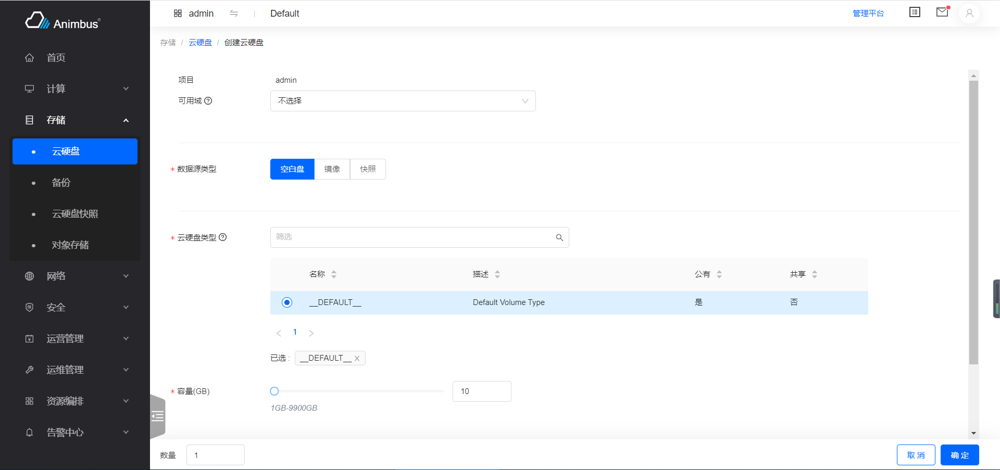
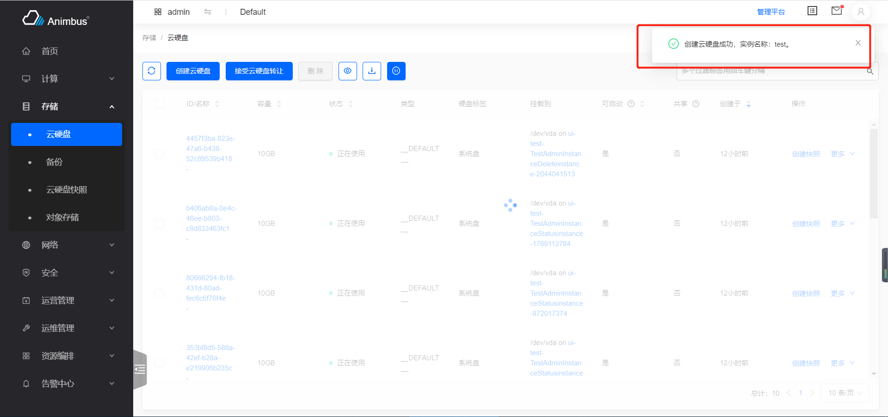

简体中文 | [English](../../en/develop/3-6-FormAction-introduction.md)

# 用途



- 操作按钮点击后，单页显示 Form 表单
- 有独立的路由可供访问
- 一般用于创建资源，或是表单内容较多的 Form
- 点击`确认`按钮后，会根据请求的发送情况，展示`loading`状态，请求成功后，会自动跳转到相应的资源列表页
- 点击`取消`按钮后，会自动跳转到相应的资源列表页
- 如果请求发送成功，会在右上角展示操作成功的提示信息，该提示信息几秒后可自动消失

  

- 如果请求发送失败，会在表单页的右上角展示错误信息，该提示信息只有点击关闭按钮后才可消失

# FormAction 代码文件

- `src/containers/Action/FormAction/index.jsx`

# FormAction 属性与函数定义介绍

- 单页表单都继承于 FormAction 组件
- 代码位置：`pages/xxxx/containers/XXXX/actions/xxx.jsx`
- 只需要复写部分函数即可完成页面的开发
- 属性与函数分为以下四种，
  - 必须复写的属性与函数，主要包含：
    - 操作的 ID
    - 操作的标题
    - 页面对应的路径
    - 资源列表页面对应的路径
    - 操作对应的权限
    - 对是否禁用操作的判定
    - 表单项的配置
    - 发送请求的函数
  - 按需复写的函数与属性，主要包含：
    - 表单的默认值
  - 无需复写的函数与属性，主要包含：
    - 当前页是否是管理平台页面
  - 基类中的基础函数，主要包含：
    - 渲染页面
    - 对请求状态的展示
    - 对请求结果的展示
  - 更详细与全面的介绍见下

## 必须复写的属性与函数

- `id`
  - 静态属性
  - 资源操作的 ID
  - 需要具有唯一性，只针对资源的`actions`中的所有操作具有唯一性即可
  - 必须复写该属性
  - 以创建云硬盘`src/pages/storage/containers/Volume/actions/Create/index.jsx`为例

    ```javascript
    static id = 'volume-create';
    ```

- `title`
  - 静态属性
  - 资源操作的标题
  - 以创建云硬盘`src/pages/storage/containers/Volume/actions/Create/index.jsx`为例

    ```javascript
    static title = t('Create Volume');
    ```

- `path`
  - 资源操作的对应的路由
  - 静态属性或静态函数
  - 静态函数时，参数为
    - 参数`item`，资源列表中的条目数据
    - 参数`containerProps`，父级 container(即按钮所在资源列表页面)的`props`属性
    - 以创建镜像`src/pages/compute/containers/Image/actions/Create.jsx`为例
      - 管理平台访问的路径是`/compute/image-admin/create`
      - 控制台访问的路径是`/compute/image/create`

      ```javascript
      static path = (_, containerProp) => {
        const { isAdminPage } = containerProp;
        return isAdminPage
          ? '/compute/image-admin/create'
          : '/compute/image/create';
      };
      ```

  - 静态属性，以创建云硬盘`src/pages/storage/containers/Volume/actions/Create/index.jsx`为例

    ```javascript
    static path = '/storage/volume/create';
    ```

- `policy`
  - 静态属性
  - 页面对应的权限，如果权限验证不通过，则不会在资源列表页面显示该操作按钮
  - 以云硬盘`src/pages/storage/containers/Volume/actions/Create/index.jsx`为例

    ```javascript
    static policy = 'volume:create';
    ```

- `allowed`
  - 静态函数
  - 判定操作是否需要被禁用
  - 返回`Promise`
  - 不需用禁用的按钮，直接写作

    ```javascript
    static allowed() {
      return Promise.resolve(true);
    }
    ```

  - 参数`item`，资源列表中的条目数据，一般用在资源列表中的条目的操作判定
  - 参数`containerProps`，父级 container(即按钮所在资源列表页面)的`props`属性，一般用在详情页下相关资源的操作判定
  - 以创建用户`src/pages/identity/containers/User/actions/Create.jsx`为例
    - 如果是域详情中的用户列表，则不展示创建用户按钮

    ```javascript
    static allowed(item, containerProps) {
      const {
        match: { path },
      } = containerProps;
      if (path.indexOf('domain-admin/detail') >= 0) {
        return Promise.resolve(false);
      }
      return Promise.resolve(true);
    }
    ```

- `name`
  - 该操作对应的名称
  - 在请求后提示语中使用该名称
  - 以云硬盘`src/pages/storage/containers/Volume/actions/Create/index.jsx`为例

    ```javascript
    get name() {
      return t('create volume');
    }
    ```

- `listUrl`
  - 该操作对应的资源列表页
  - 操作请求成功后，会自动进入到资源列表页
  - 以云硬盘`src/pages/storage/containers/Volume/actions/Create/index.jsx`为例

    ```javascript
    get listUrl() {
      return this.getRoutePath('volume');
    }
    ```

- `formItems`
  - 该操作表单对应的表单项配置列表
  - 每个表单项的配置信息可参考[3-10-FormItem 介绍](3-10-FormItem-introduction.md)
  - 以创建域`src/pages/identity/containers/Domain/actions/Create.jsx`为例
    - 表单包含名称、描述、状态

    ```javascript
    get formItems() {
      return [
        {
          name: 'name',
          label: t('Name'),
          type: 'input',
          placeholder: t('Please input name'),
          required: true,
          help: t('The name cannot be modified after creation'),
        },
        {
          name: 'description',
          label: t('Description'),
          type: 'textarea',
        },
        {
          name: 'enabled',
          label: t('Status'),
          type: 'radio',
          optionType: 'default',
          options: statusTypes,
          required: true,
          isWrappedValue: true,
          help: t(
            'Forbidden the domain will have a negative impact, all project and user in domain will be forbidden'
          ),
        },
      ];
    }
    ```

- `onSubmit`
  - 该操作的请求函数
  - 操作请求成功后，会自动进入到资源列表页
  - 操作失败后，会在表单页显示错误提示
  - 返回`Promise`
  - 返回表单对应的`store`中的函数
  - 以创建域`src/pages/identity/containers/Domain/actions/Create.jsx`为例

    ```javascript
    onSubmit = (values) => {
      values.enabled = values.enabled.value;
      return this.store.create(values);
    };
    ```

## 按需复写的属性与函数

- `init`
  - 初始化操作
  - 在其中定义`this.store`，`loading`状态的展示是基于`this.store.isSubmitting`
  - 在其中调用获取表单所需其他数据的函数
  - 对`this.state`中属性的更新
  - 以创建云硬盘`src/pages/storage/containers/Volume/actions/Create/index.jsx`为例
    - 获取配额信息、可用域数据、镜像数据、云硬盘类型
    - 更新`this.state`中的初始值

    ```javascript
    init() {
      this.snapshotStore = globalSnapshotStore;
      this.imageStore = globalImageStore;
      this.volumeStore = globalVolumeStore;
      this.volumeTypeStore = globalVolumeTypeStore;
      this.backupstore = globalBackupStore;
      this.getQuota();
      this.getAvailZones();
      this.getImages();
      this.getVolumeTypes();
      this.state = {
        ...this.state,
        count: 1,
        sharedDisabled: false,
      };
    }
    ```

- `defaultValue`
  - 表单的初始值
  - 默认值是`{}`
  - 以创建云硬盘`src/pages/storage/containers/Volume/actions/Create/index.jsx`为例
    - 设置表单的默认源、大小、项目、可用域、云硬盘类型

    ```javascript
    get defaultValue() {
      const size = this.quotaIsLimit && this.maxSize < 10 ? this.maxSize : 10;
      const { initVolumeType } = this.state;
      const values = {
        source: this.sourceTypes[0],
        size,
        project: this.currentProjectName,
        availableZone: (this.availableZones[0] || []).value,
        volume_type: initVolumeType,
      };
      return values;
    }
    ```

- `nameForStateUpdate`
  - 表单项内容变动时，更新到`this.state`中的表单键值对
  - 这些存储到`this.store`中的键值对往往会影响表单项的展示，需要配合`get formItems`中的代码使用
    - 如展开、隐藏更多配置项
    - 如某些表单项必填性的变动
  - 默认对`radio`, `more`类型的表单项的变动保存到`this.state`中
  - 以创建云硬盘`src/pages/storage/containers/Volume/actions/Create/index.jsx`为例
    - 当`source=image`时，展示镜像选择列表，并基于镜像的选择，设置云硬盘容量的最小值
    - 当`source=snapshot`时，展示云硬盘快照列表，并基于镜像的选择，设置云硬盘容量的最小值

    ```javascript
    get nameForStateUpdate() {
      return ['source', 'image', 'snapshot'];
    }
    ```

- `renderFooterLeft`
  - 对表单底部左侧内部的渲染
  - 默认返回`null`
  - 以创建云硬盘`src/pages/storage/containers/Volume/actions/Create/index.jsx`为例
    - 展示批量创建的数量
    - 基于输入的数量与剩余配额判定当前表单是否正确

    ```javascript
    const { count = 1 } = this.state;
    const configs = {
      min: 1,
      max: 100,
      precision: 0,
      onChange: this.onCountChange,
      formatter: (value) => `$ ${value}`.replace(/\D/g, ''),
    };
    return (
      <div>
        <span>{t('Count')}</span>
        <InputNumber
          {...configs}
          value={count}
          className={classnames(styles.input, 'volume-count')}
        />
        {this.renderBadge()}
      </div>
    );
    ```

- `errorText`
  - 错误信息的展示
  - 一般不需要复写
  - 以创建云硬盘`src/pages/storage/containers/Volume/actions/Create/index.jsx`为例
    - 展示了配额验证不通过的错误信息，当配额验证不通过时，并不发送请求，而是直接展示了错误提示信息

    ```javascript
    get errorText() {
      const { status } = this.state;
      if (status === 'error') {
        return t(
          'Unable to create volume: insufficient quota to create resources.'
        );
      }
      return super.errorText;
    }
    ```

- `instanceName`
  - 请求发送后，提示信息中的资源名称
  - 默认值为`this.values.name`
  - 以创建云硬盘`src/pages/storage/containers/Volume/actions/Create/index.jsx`为例
    - 如果是批量创建云硬盘，则按`${name}-${index + 1}`的形式展示名称

    ```javascript
    get instanceName() {
      const { name } = this.values || {};
      const { count = 1 } = this.state;
      if (count === 1) {
        return name;
      }
      return new Array(count)
        .fill(count)
        .map((_, index) => `${name}-${index + 1}`)
        .join(', ');
    }
    ```

- `labelCol`
  - 配置表单左侧标签的布局
  - 默认值为

    ```javascript
    get labelCol() {
      return {
        xs: { span: 5 },
        sm: { span: 3 },
      };
    }
    ```

  - 以创建镜像`src/pages/compute/containers/Image/actions/Create.jsx`为例

    ```javascript
    get labelCol() {
      return {
        xs: { span: 6 },
        sm: { span: 5 },
      };
    }
    ```

- `wrapperCol`
  - 配置表单右侧内容的布局
  - 默认值为

    ```javascript
    get wrapperCol() {
      return {
        xs: { span: 10 },
        sm: { span: 8 },
      };
    }
    ```

## 不需要复写的属性与函数

- `values`
  - 表单验证成功后，更新的表单值
- `isAdminPage`
  - 当前页面是否是“管理平台”的页面
- `getRoutePath`
  - 生成页面 Url 的函数
  - 如：需要给关联资源提供跳转功能，使用该函数，可以在控制台跳转到控制台的相应地址，在管理平台跳转到管理平台的相应地址

## 基类中的基础函数

- `FormAction`继承于`BaseForm`
- 建议查看代码理解，`src/components/Form/index.jsx`
